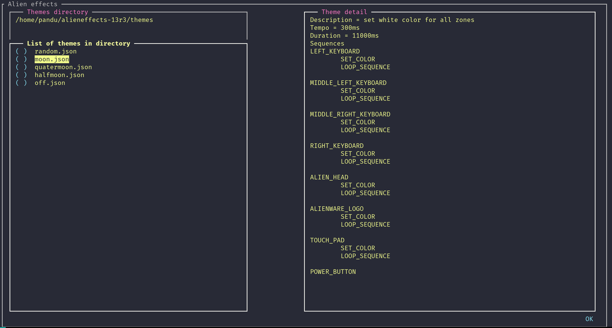

# Alien Effects for Alienware 13 R3

[](https://github.com/Yashasvi-Sriram/alieneffects-13r3/blob/master/LICENSE)
[]()
[](https://pypi.org/project/alienware-13r3-alien-effects/)

`alieneffects-13r3` is an lightweight and highly customizable application to control LED backlights (alien effects) of Alienware 13 R3 laptop in linux.

# Installation and usage

* python version 
    * 3.6 is recommended
    * 3.4 may not work
    * 2 is strongly discouraged
* `sudo pip3 install alienware-13r3-alien-effects` to install
* To install from source, clone this repo and `sudo python3 setup.py install`
* `sudo alieneffects-13r3 --THEME_FILE <path-to-theme-file>` to apply a theme
* `sudo alieneffects-13r3` to open a Textual User Interface where you can select themes
    * First field is the themes directory
    * After setting it, a list of files in the that directory will appear below
    * By hovering through them, you can see the overview of each theme on the right panel
    * Press enter to apply a theme
    * Some themes have stochasticity (randomness) in them, so applying same theme multiple times can lead to different themes



# Config file

* Themes directory by default will be your home directory
* You can write a config file `.alieneffects-13r3.json` to specify themes directory
```
    {
      "THEMES_DIRECTORY": "/home/foo/bar/themes"
    }
```
# Writing your own themes

* The log will be written to `.alieneffects-13r3.log`
* Theme files are also json files and can contain following keys
    * DESCRIPTION - describes the theme
    * TEMPO - the frequency of blinking and/or morphing
    * DURATION - duration of each effect
    * ZONES - sequences of each zone
        * <ZONE-NAME> ex. POWER_BUTTON
            * <SEQUENCE-OF-EFFECTS> ex.
                * SET_COLOR, COLOR
                * BLINK_COLOR, COLOR
                * MORPH_COLOR, COLOR1, COLOR2
                * LOOP_SEQUENCE
* Same sequence can be applied for multiple zones by delimiting zones with '|'
* If an effect does not have a color, a random color will be choosen
* The simplest theme is to switch off all lights
```
    {
      "DESCRIPTION": "sets all zones to black color i.e. switches off all lights",
      "ZONES": {
        "POWER_BUTTON|ALIENWARE_LOGO|ALIEN_HEAD|LEFT_KEYBOARD|TOUCH_PAD|MIDDLE_LEFT_KEYBOARD|MIDDLE_RIGHT_KEYBOARD|RIGHT_KEYBOARD": [
          {
            "EFFECT": "SET_COLOR",
            "COLOR": [
              0,
              0,
              0
            ]
          },
          {
            "EFFECT": "LOOP_SEQUENCE"
          }
        ]
      }
    }
```
* The random theme sets random color to all zones
```
{
  "DESCRIPTION": "set same random color for all zones",
  "TEMPO": 300,
  "DURATION": 11000,
  "ZONES": {
    "ALIENWARE_LOGO|ALIEN_HEAD|LEFT_KEYBOARD|TOUCH_PAD|MIDDLE_LEFT_KEYBOARD|MIDDLE_RIGHT_KEYBOARD|RIGHT_KEYBOARD": [
      {
        "EFFECT": "SET_COLOR"
      },
      {
        "EFFECT": "LOOP_SEQUENCE"
      }
    ]
  }
}
```

# Introduction - Reverse Engineering


Alienware 13 R3 has 8 configurable light zones as listed in the table below.

All lights can be controlled via USB protocol.

For this specific device `vendor Id = 0x187c` and `product Id = 0x0529`

Commands can be passed using control transfers of USB protocol.

Note that this application can only be used for Alienware 13 R3 model, for other models refer to [Alienfx](https://github.com/trackmastersteve/alienfx) by trackmastersteve

# Control transfer: Write operation parameters

    bmRequestType = 0x21
        0... .... : Host to Device
        .01. .... : Request Type = Class
        ...0 0001 : Recipient = Interface
    bRequest = 9
    wValue = 0x0202
    wIndex = 0

# Control transfer: Read operation parameters

    bmRequestType = 0xa1
        1... .... : Device to Host
        .01. .... : Request Type = Class
        ...0 0001 : Recipient = Interface
    bRequest = 9
    wValue = 0x0202
    wIndex = 0

# Commands

| Command | Packet Structure (bytes) | Desciption | Comment | 
| -- | -- | -- | -- |
| Reset |  2 7 t 0 0 0 0 0 0 0 0 0 | t : type, t=3 : reset all off and stops the execution of sequences t=4 : reset all on | Should call before every change. This takes some time, and you should wait until the operation ends. Premature commands might fail.  
| Get status |  2 6 0 0 0 0 0 0 0 0 0 0 | S : Sequence ID, Z : Zone | Can use this to wait until status is ready | 
| Morph |  2 1 S Z Z Z r g b R G B | S : Sequence ID, Z : Zone | Color changes from `r g b` to `R G B` . All bands use 8-bit color encoding. So each value must be between 0-255. | 
| Pulse |  2 2 S Z Z Z r g b 0 0 0 | S : Sequence ID, Z : Zone |  | 
| Simple set |  2 3 S Z Z Z r g b 0 0 0 | S : Sequence ID, Z : Zone |  | 
| Loop |  2 4 0 0 0 0 0 0 0 0 0 0 | S : Sequence ID, Z : Zone | Without this, LEDs will go off after walking through the user-specified   color sequence. TODO: how does this know which sequence is the target? The last one mentioned? What happens if sequences are interleaved?) | 
| Execute |  2 5 0 0 0 0 0 0 0 0 0 0 | S : Sequence ID, Z : Zone | This must be called at the end. Start executing color sequences | 
| Save next command |  2 8 m 0 0 0 0 0 0 0 0 0 | m : mode, m=01: Initial State m=2: Plugged in - Sleep; Only the power-button works in this mode? m=5: Plugged in - Normal m=6: Plugged in - Charging m=7: On Battery - Sleep m=8: On Battery - Normal m=9: On Battery - Low | Save the next command to the specified mode. Must be followed by an Action or Loop | 
| Save all |  2 9 0 0 0 0 0 0 0 0 0 0 |  | Save slots permanently. If this command is not called, data slots will be lost on reboot |
| Tempo |  2 e t t 0 0 0 0 0 0 0 0 | t: tempo | AlienFX sets this value between 00:1e ~ 03:ae. |

# Zone codes

* A 16 bit code space is to reference each light zone.
* One hot encoding is used; i.e. address for each zone has 1 at a unique place and 0's elsewhere
* Multiple zones can be addressed by ORing their codes
    * For example to address the entire keyboard use 0x1\|0x2\|0x4\|0x8=0xF code
* A lot more zone codes and command codes might exist, which can do things we dont know about (yet), 
    * For example setting multiple zones to different colors and such stuff

| Zone Alienware 13 R3 | Binary | Hex | 
| -- | -- | -- | 
| Keyboard right | 000 0000 0000 0001 | 0x0001 |
| Keyboard middle-right | 000 0000 0000 0010 | 0x0002 |
| Keyboard middle-left | 000 0000 0000 0100 | 0x0004 |
| Keyboard left | 000 0000 0000 1000 | 0x0008 |
| unknown/unused | 000 0000 0001 0000 | 0x0010 |
| Alien head | 000 0000 0010 0000 | 0x0020 |
| Alienware logo | 000 0000 0100 0000 | 0x0040 |
| Touch pad | 000 0000 1000 0000 | 0x0080 |
| Power button | 000 0001 0000 0000 | 0x0100 |

# How it works?

### Simple Set Color example
* Send a reset command
* Send a set color effect command (to say touch pad)
* Send a loop command
* Send an execute command

The touch pad color changes and stays put.
If the loop command is not issued then the color goes away after a certain time.

### Blink or Morph example
* Send a reset command
* Send a tempo command
* Send a blink effect command (to say touch pad)
    * Morph effect command needs 2 colors
* Send a loop command
* Send an execute command

Blink effect and Morph Effect need an extra tempo command, which determines the rate of blinking or morphing.

### Multiple effects at different zones
* Send a reset command
* Send a tempo command
* Send a blink effect command (to say touch pad)
* Send a morph effect command (to say logo)
* Send a loop command
* Send an execute command

The blinking happens for sometime and stops.
Then morphing happens for sometime and stops.
This happens because both are set on same sequence.

### Multiple effects at different zones simultaneously
* Send a reset command
* Send a tempo command
* Send a blink effect command on sequence 1 (to say touch pad)
* Send a morph effect command on sequence 2 (to say logo)
* Send a loop command
* Send an execute command

The blink and morphing happens simulataneously.
But the blinking stops after some time.
This happens because loop command affects the latest sequence issued before it.
So we need to send two loop commands after every set of commands belonging to one sequence

### Multiple effects at different zones simultaneously and continuously
* Send a reset command
* Send a tempo command
* Send a blink effect command on sequence 1 (to say touch pad)
* Send a loop command
* Send a morph effect command on sequence 2 (to say logo)
* Send a loop command
* Send an execute command

The blink and morphing happens simulataneously and continously.
Multiple zones can be referenced at once for an effect as described in Zone codes section

# Misc
* Some zones (like power button) seems to be only be accessible in some states (like pugged in, on battery, on battery low) only
* If same zone is addressed in different sequences flashing can happen
* If you cannot control touch pad, set `Trackpad backlight` to `Enable` in BIOS settings

# Disclaimer

* All the information here is obtained via trail and error reverse engineering, because the alienware lights software doesn't seem to be opensource
* There is no conclusive evidence that these methods are the best way to go
* But they do work and did no harm to my system until now

# References
[Alienfx](https://github.com/trackmastersteve/alienfx) by trackmastersteve
